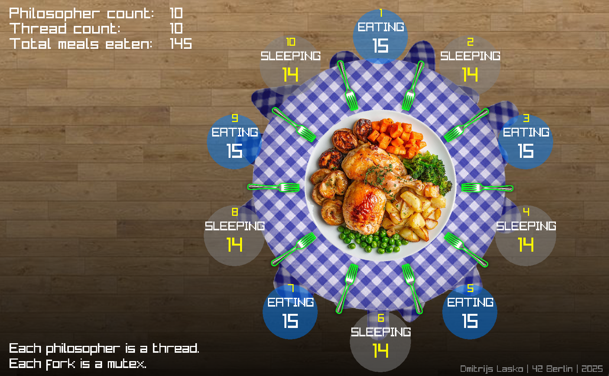

**Simple visualizer for School 42 Philosophers project, written in C + Raylib.**



**To use, you might need to add fflush(stdout) to your philosophers output to flush the buffer after each line.**

**To launch:**
1. Clone this repo into your philo project: philo/visualizer (or any other folder name)
```bash
git clone https://github.com/dmitrijslasko/42_philosophers_visualizer visualizer
```
1. Compile the visualizer: make -C visualizer
```bash
make -C visualizer
```
1. Launch:
2. ```bash
./philo <10> <800> <200> <200> | ./visualizer/visualizer
```
1. The output of your philosophers' program will go into the visualizer through a pipe.
It will pick up the number of philosophers automatically on the go.
